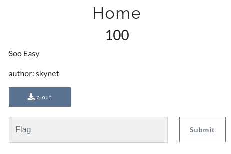

# Rev - Home - 100

You are given with this file - [https://ufile.io/eipp60mg](https://ufile.io/eipp60mg)

After checking for strings in the binary we get the flag as

Flag - **0xL4ugh{34SY_R3V_Ch411}**
