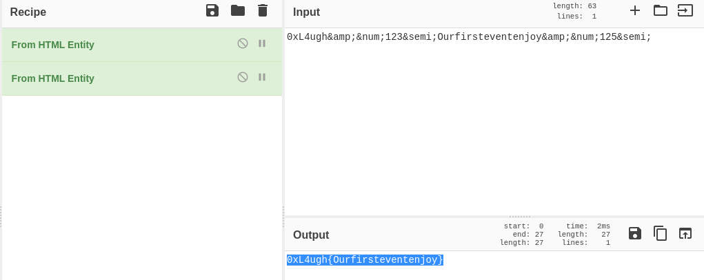

# Rev - WannaCry  - 100

File - [https://ufile.io/0okr7vzx](https://ufile.io/0okr7vzx)

After running strings on the file we get 

```bash
0xL4ugh&amp;&num;123&semi;Ourfirsteventenjoy&amp;&num;125&semi;
```

After Decoding this string as 



We get the flag as

Flag - **0xL4ugh{Ourfirsteventenjoy}**
