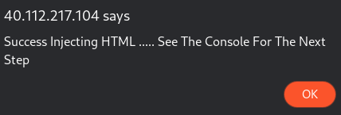

# Web - DarkLogin - 200


This was one of the toughest challenge(for me being a Noob)

Visiting the URL gives me


After looking at the page's source code

```html
<!-- Search Deeper To Find Your KEY!! -->
    <!-- Your Eyes Is Not The Only Way That You Can See From-->
    <!--Try Think Harder, Search Deeper About Kinda File ;)-->
    <!-- LnR4dA== -->
```

The last line decodes(base64) as **.txt**

Since the words KEY is in CAPS I tried going to - [http://40.112.217.104/DarkLogin/KEY.txt](http://40.112.217.104/DarkLogin/KEY.txt)

we get 


we can see that email and password are encoded

Email - **21232f297a57a5a743894a0e4a801fc3@DarkLogin.death —> 21232f297a57a5a743894a0e4a801fc3 —> admin**(MD5) use [https://crackstation.net/](https://crackstation.net/) to decode

Password - 


**Cyberchef Receipe** 

Unescape_string()
From_Base64('',true)
Unescape_string()
Unescape_string()

So we get 

username - **admin@DarkLogin.death**

password - **W3@llL1k3D@rkn3ss**

Once we login into the portal 

we get 


So I tried Injecting XSS Payload into the field


After giving some random valid input


After inspecting the source code I have got a Interesting js file named **.xss.js**


So this checks if flag ID exists or not I took help from my friend and figured out the right syntax as

`<script>document.getElementById('main').setAttribute('id','flag');</script>`

This basically creates a ID called flag so that that script get's executed.

After injecting the above piece of line as code I get the following screens and I was asked to check the Console




After checking the web console I have got a mega link


After opening the file in the mega link


I get a pastebin link and a PHP file

Pastebin Link - [https://pastebin.com/YdLpbznz](https://pastebin.com/YdLpbznz) which is Password protected

I was unable to view the contents of   - [http://40.112.217.104/DarkLogin/796f754e6f774d650a.php](http://40.112.217.104/DarkLogin/796f754e6f774d650a.php) as it redirects to an error page

I tried logging in by changing the post URL in the login page as the given php file and I get the password ( I am not sure why that worked :{ )


and I finally get the Flag as 


Flag - **0xL4ugh{M1nd_Bl0w1ng_15_C00l}**
