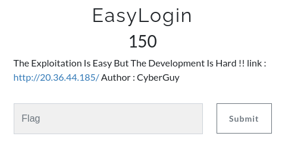
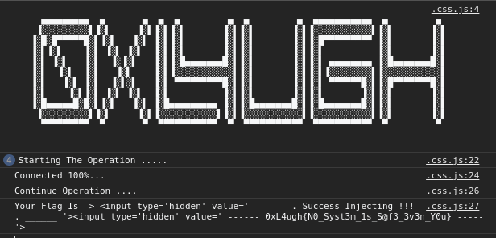
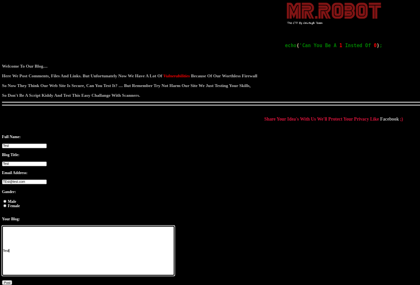
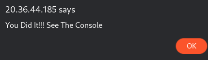

# Web - EasyLogin - 150



After visitng the given URL and inspecting the source code we are gievn the creds as admin(username), admin(password)

After we login



Now once we post a new post and inspect the source code, we get a hint which is

```html
<!--
Hint: Inject An HTML Tag And Give Him The ID flagHunt
-->
```

So we need to inject the flagHunt tag into the post as 

**<script>document.getElementById('main').setAttribute('id','flag');</script>**  in the Your Blog section

Once we post we get this



and are requested to check the console



Flag - **0xL4ugh{N0_Syst3m_1s_S@f3_3v3n_Y0u}**
