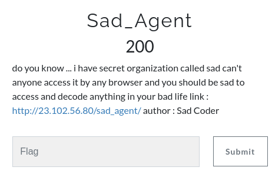
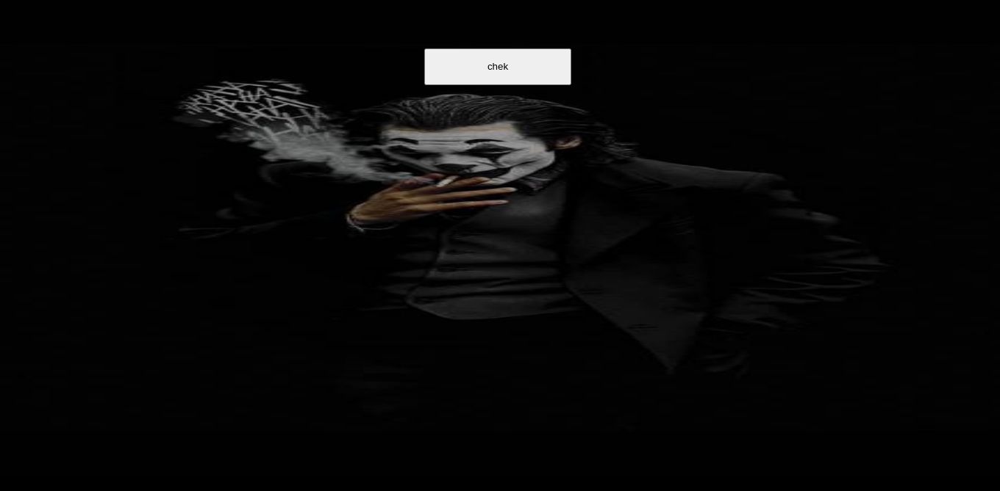
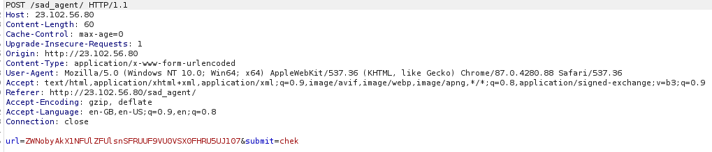
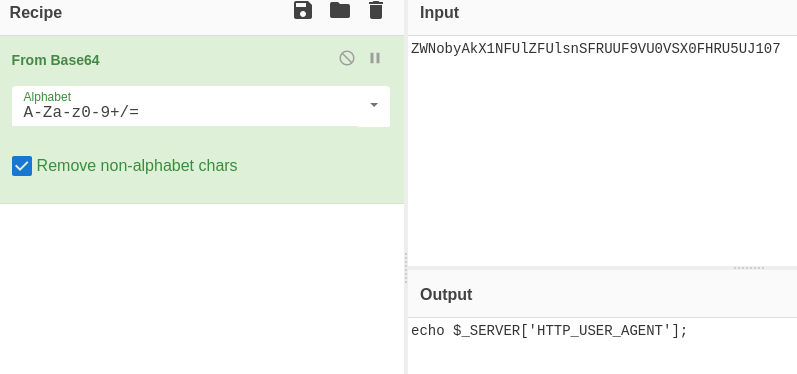
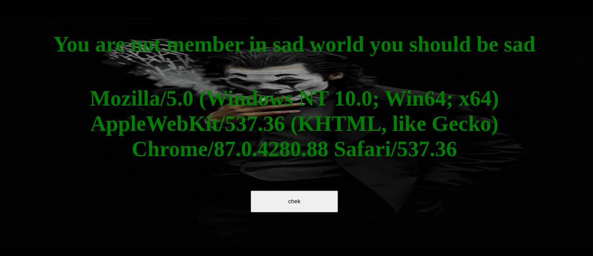
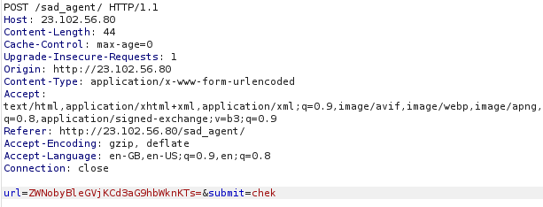
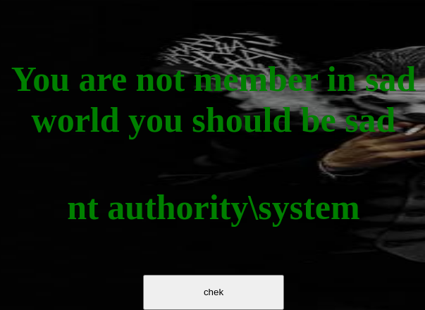
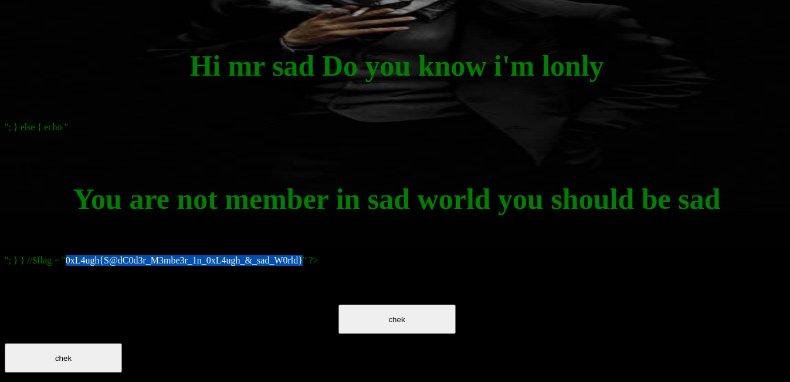

# Web - Sad_Agent - 200

When we visit this URL we get

Whenwe click on **chek** button we see a Hidden Parameter sent which is **url** 

after decoding the value as Base64 we get 

Looks like it's evaluating the User-Agent so we get the page as

So let's try to send commands to the server by encoding the payload as Base64

**ZWNobyBleGVjKCd3aG9hbWknKTs=** -> **echo exec('whoami');**

so the request becomes 

we get the response as 

)

Oh! I see this is a Windows System

let's try **ZWNobyBzeXN0ZW0oJ21vcmUgaW5kZXgucGhwJyk7Cg==** which is **echo system('more index.php');** (After trial and error)

we get this page with the flag

 

**Flag - 0xL4ugh{S@dC0d3r_M3mbe3r_1n_0xL4ugh_&_sad_W0rld}**
